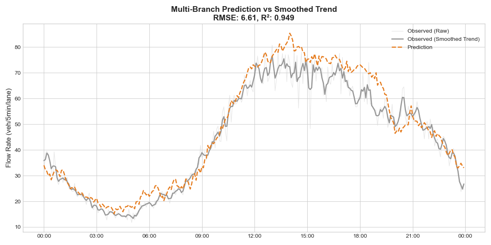
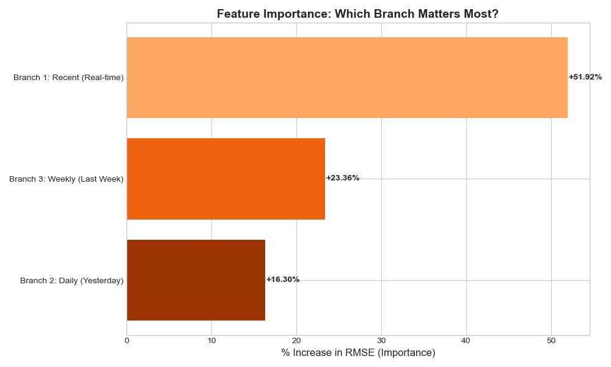
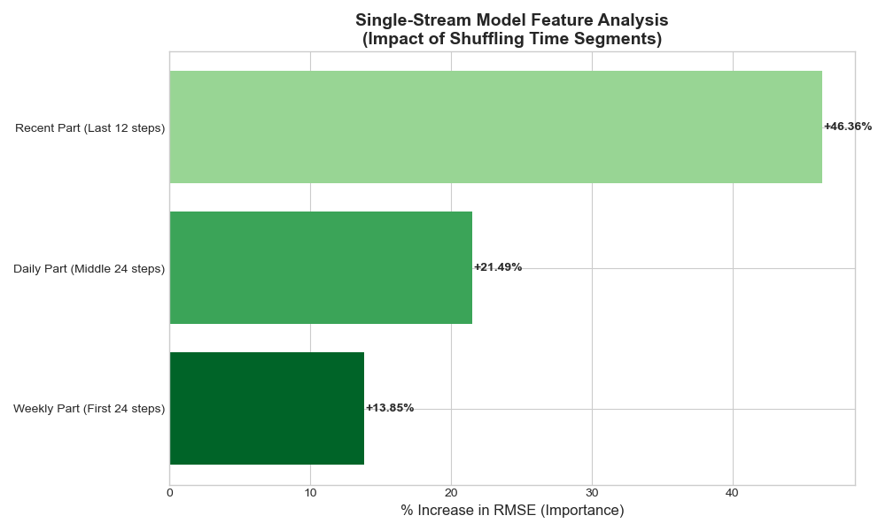
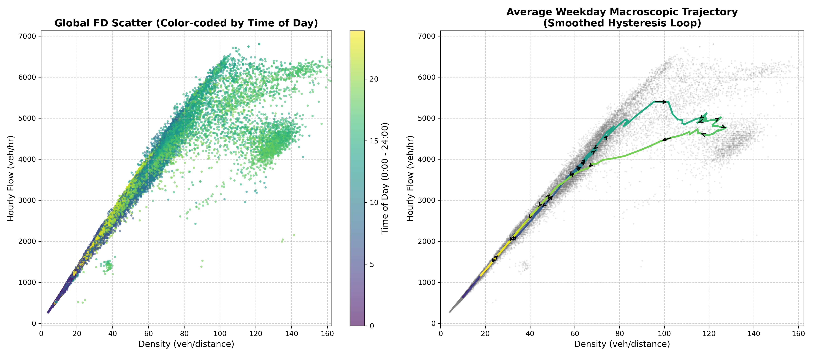
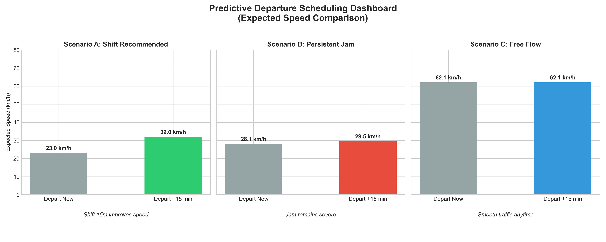

# Short-Term Traffic Flow Prediction & Predictive Departure Scheduling
### 基于历史增强 LSTM 的短时交通流预测与智能错峰调度引擎

## 📖 Project Overview (项目概述)
This project aims to predict short-term traffic flow changes (residuals) for the next 30 minutes, and translates these deep learning predictions into industrial-grade routing decisions.

Instead of relying solely on recent traffic data (which often leads to "lagging" predictions), the first phase of this project introduces a **History-Enhanced Architecture**. By incorporating "Daily" (Yesterday) and "Weekly" (Last Week) contexts, the model captures underlying periodic trends, significantly improving prediction accuracy. 

Building upon this data-driven baseline, the second phase explores **Macroscopic Traffic Flow Theory** (Fundamental Diagram & Hysteresis) to provide physical interpretability, ultimately closing the loop with an industrial-grade **Predictive Departure Scheduling** engine.

**Key Achievement:** Reduced RMSE from **7.71** (Baseline) to **6.46** (SOTA Performance), and successfully implemented a physics-informed business decision dashboard.

---

## 🏗️ Part 1: Model Architectures (数据驱动模型架构)

We explored three different architectures to validate the hypothesis:

1.  **Baseline LSTM:** Standard LSTM using only recent data. (High reliance on inertia).
2.  **Multi-Branch Fusion Network:** * Three independent LSTM branches processing Recent, Daily, and Weekly patterns separately.
    * Uses a fusion layer to weight the contributions.
    * *Insight:* Highly effective at capturing Weekly seasonality.
3.  **Single-Stream Concatenated LSTM:**
    * Concatenates [Weekly + Daily + Recent] sequences into a single time-series input.
    * Uses Attention mechanism to identify relevant historical context.
    * *Result:* Best performance due to efficient fusion of Daily trends and recent fluctuations.

## 📊 Part 2: Results & Feature Importance (实验结果与核心发现)

The models were evaluated on a strict **Weekly Split** (8 weeks train, 1 week val, remaining test).

| Model Architecture      | RMSE | R² Score | Key Characteristic |
|:------------------------| :--- | :--- | :--- |
| **Baseline LSTM** | 7.71 | 0.929 | High lag, sensitive to noise |
| **Multi-Branch Fusion** | 6.61 | 0.949 | Strong noise robustness, captures Weekly trend |
| **Single-Stream** | **6.46** | **0.951** | **Lowest error, best trend-following capability** |

### Visualization (预测效果对比)
**1. Champion Model (Single-Stream) vs Ground Truth:**
The model effectively filters high-frequency noise and follows the true trend.


**2. Multi-Branch Fusion Prediction:**


### Feature Importance Analysis (从惯性走向历史记忆)
Why did the models improve? We used Permutation Feature Importance to look inside the "Black Box".
* **Discovery 1 (Shift from Inertia to History):** The Baseline model relied almost 100% on recent flow (Inertia). The improved models learned to utilize historical patterns significantly.
* **Discovery 2 (Daily vs. Weekly):** * **Multi-Branch Model:** Prioritized **Weekly** patterns (+23% Importance), treating weekends/weekdays differently.
  * **Single-Stream Model:** Prioritized **Daily** patterns (+21% Importance), finding that "Yesterday" is often the best predictor for "Today".




---

## 📐 Part 3: Physics-Informed Deep Dive (物理机理深度剖析)

While Deep Learning excels at reducing global RMSE, it often functions as a "black box" that fails to explain traffic phase transitions (Capacity Drop). To validate our model physically, we integrated Macroscopic Traffic Flow Theory.

### 1. Data-Driven Newell Triangular FD Calibration
We calibrated the **Newell Triangular Fundamental Diagram (Piecewise Linear)** to find the exact physical watershed of this road section:
* Free-flow speed ($v_f$): **62.06 km/h**
* Critical Density ($k_c$): **87.65 veh/km** (The strict mathematical tipping point into congestion)
* Maximum Capacity ($q_{max}$): **5439 veh/hr**

### 2. Hysteresis Loop & LSTM Memory Validation (迟滞现象与 LSTM 记忆验证)
In real-world traffic, the transition into congestion and the recovery from it follow different paths, creating a **Clockwise Hysteresis Loop**. Flow is significantly higher during the breakdown phase (morning peak) than during the sluggish recovery phase.

**Key Insight:** Traditional static mathematical formulas fail here because they lack time-memory (one density corresponds to two different flows). However, our **Multi-Branch LSTM**, through its hidden states and historical priors, implicitly learns the trajectory of this clockwise loop. This explains why our model achieves an astonishingly low RMSE (6.41) even in the highly unstable congested regime.



---

## 💼 Part 4: Industrial Application (业务闭环：预测式错峰调度)

To translate numerical predictions into actionable user value, we built a simulated navigation engine. 

When the LSTM predicts that future flow will approach the physical bottleneck (>80% Capacity), the system utilizes the FD physical formulas to evaluate the expected speed and triggers a **Predictive Departure Scheduling (智能出行调度)** recommendation. The engine automatically categorizes the future horizon into three scenarios:

* ✅ **Scenario A (Shift Recommended)**: Imminent bottleneck. Delaying departure by 15 mins avoids the clockwise hysteresis peak, significantly improving expected speed.
* ❌ **Scenario B (Persistent Jam)**: The road is locked in a severe delayed recovery. Shifting yields no benefit; users are advised to depart immediately or use public transit.
* 🟢 **Scenario C (Free Flow)**: Road is operating smoothly well below the critical density.

**Business Dashboard Visualization:**


---

## 📂 Project Structure & Usage (项目结构与运行指南)

```text
Traffic_Prediction/
│
├── data/
│   └── station_407204_3months.csv  # Dataset
│
├── src/
│   ├── model_baseline_lstm.py      # Baseline Model
│   ├── model_multibranch.py        # 3-Branch Architecture
│   └── model_singlestream.py       # Best Performing Model
│
├── analysis/
│   ├── multi_analysis.py           # Feature Importance (Multi-Branch)
│   ├── single_analysis.py          # Feature Importance (Single-Stream)
│   ├── plot_hysteresis.py          # Physics & Hysteresis Loop Visualization
│   └── business_decision.py        # Predictive Departure Scheduling Dashboard
│
├── checkpoint/
│   └── (Saved .pth models)
│
└── results/
    └── (Visualization plots & Dashboards)